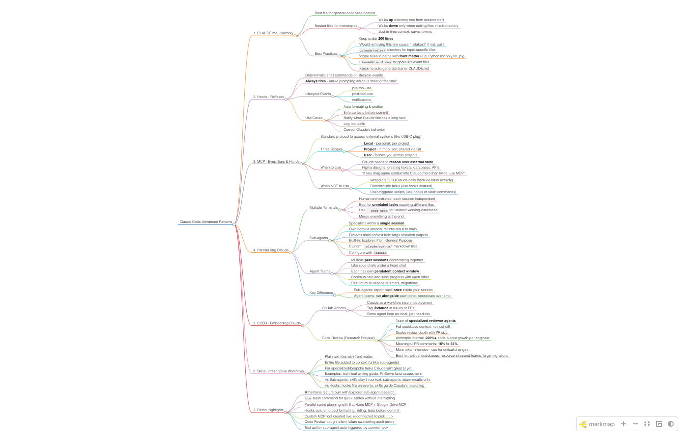
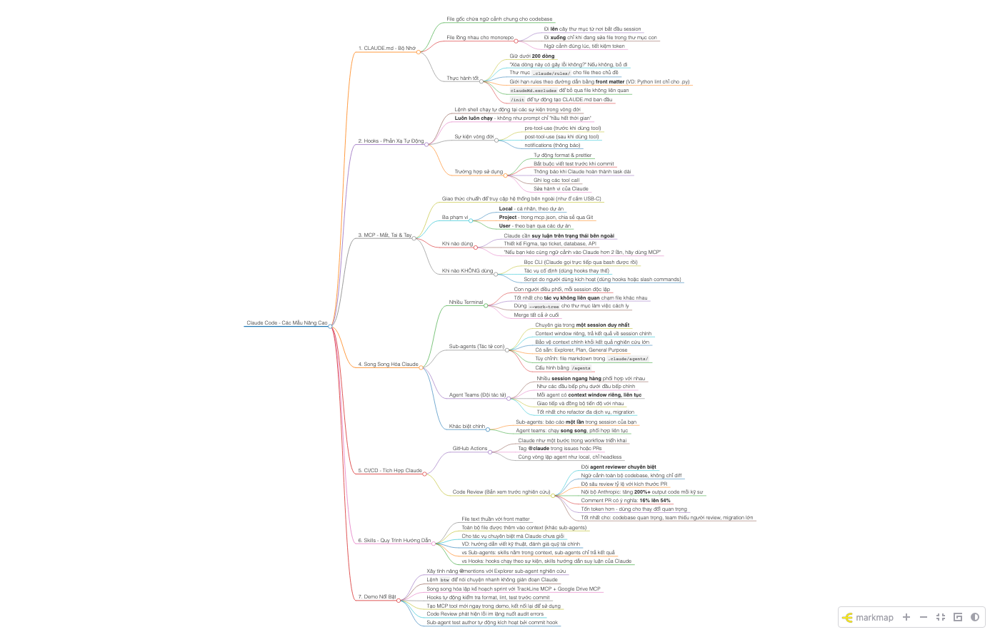

# Video Transcriber & Mind Map Generator

Drop a video or audio file, get a full transcript, summary, and interactive mind maps (English + Vietnamese).

## Pipeline

```
input/video.mp4 ─→ ffmpeg ─→ whisper ─→ transcript ─→ Claude API ─→ summary + mind maps
```

## Screenshots

### Mind Map (English)


### Mind Map (Vietnamese)


## Requirements

- [ffmpeg](https://formulae.brew.sh/formula/ffmpeg)
- [mlx-whisper](https://github.com/ml-explore/mlx-examples/tree/main/whisper) - `pip3 install mlx-whisper`
- [markmap-cli](https://github.com/markmap/markmap) - `npm install -g markmap-cli`
- [anthropic](https://github.com/anthropics/anthropic-sdk-python) - `pip3 install anthropic`

## Setup

```bash
# Install dependencies
brew install ffmpeg
pip3 install mlx-whisper anthropic
npm install -g markmap-cli

# Add API key
echo 'ANTHROPIC_API_KEY=sk-...' > .env
```

## Usage

```bash
# Drop a video or audio file into input/
cp ~/recording.mp4 input/

# Run
./transcribe.sh
```

## Supported Formats

| Type  | Formats                          |
|-------|----------------------------------|
| Video | .mov, .mp4, .mkv, .avi, .webm   |
| Audio | .mp3, .wav, .m4a, .flac, .ogg   |

## Output

```
output/
  transcript.txt     # Raw Whisper transcript
  summary.md         # Key points summary
  mindmap_en.html    # Interactive mind map (English)
  mindmap_vi.html    # Interactive mind map (Vietnamese)
```

Without `ANTHROPIC_API_KEY`, only `transcript.txt` is generated.

## Tech Stack

- **ffmpeg** - Audio extraction from video
- **mlx-whisper** (large-v3-turbo) - Speech-to-text on Apple Silicon
- **Claude API** (Sonnet) - Summary and mind map generation
- **markmap** - Interactive HTML mind map rendering
